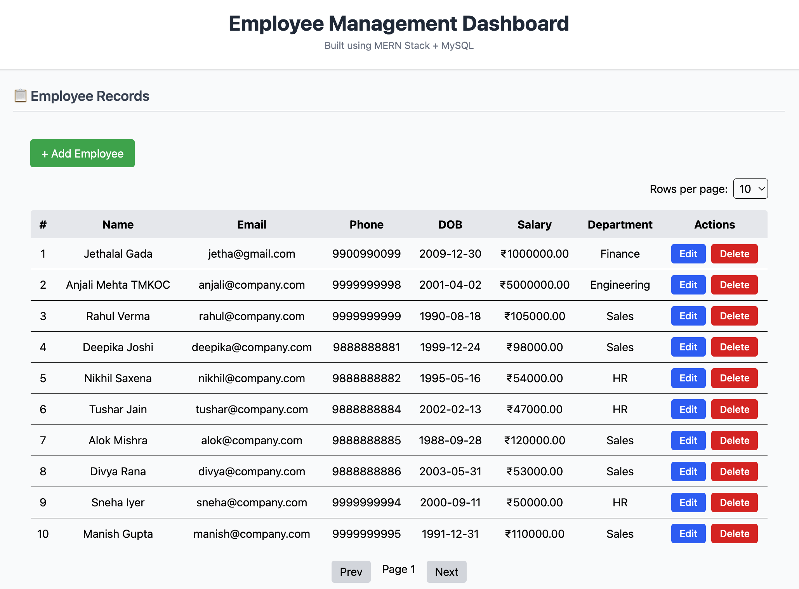
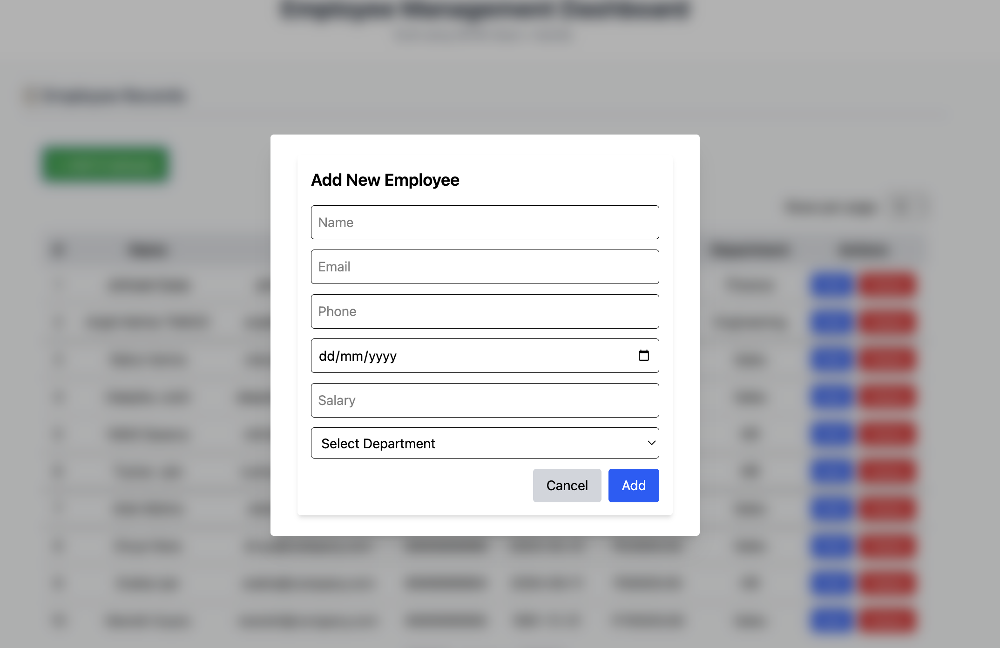
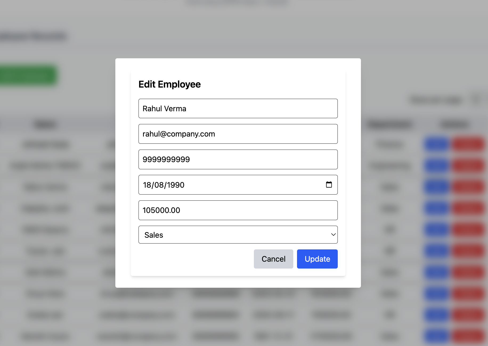
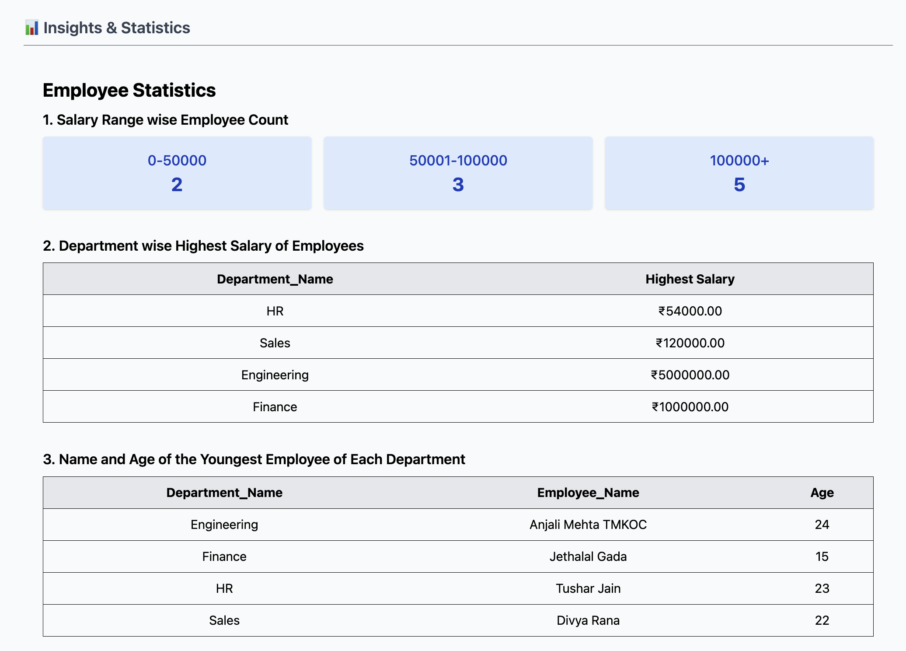

# MERN Stack Employee Management System (with MySQL)

A full-stack MERN application for managing employees and department-wise statistics. Built using **React + React Query** (frontend), **Node.js + Express** (backend), and **MySQL** (database) without ORM.

---

## Features

* List all employees with pagination
* Choose rows per page (5 / 10 / 20)
* Add, Edit, and Delete employees
* Department dropdown populated dynamically
* Validations on client and server side (with SweetAlert2 feedback)
* Statistics:

  * Department-wise highest salary
  * Salary range-wise employee count
  * Youngest employee (name & age) in each department

---

## Tech Stack Used

| Layer      | Tech Used                                    |
| ---------- | -------------------------------------------- |
| Frontend   | React.js + Tailwind CSS + React Query + Vite |
| Backend    | Node.js + Express.js                         |
| Database   | MySQL                                        |
| API Client | Axios                                        |
| UI Alerts  | SweetAlert2                                  |
| Validation | Custom JS + SweetAlert2                      |

---

## Folder Structure

```
MERN_EMPLOYEE_APP/
├── backend/
│   ├── controllers/
│   ├── routes/
│   ├── validations/
│   ├── config/
│   ├── .env
│   └── server.js
├── frontend/
│   ├── src/
│   │   ├── api/
│   │   ├── components/
│   │   ├── validations/
│   │   └── App.jsx
│   └── index.html
├── db/
│   └── schema.sql
└── README.md
```

---

## Setup Instructions

### 1. Clone the Repository

```bash
git clone https://github.com/<your-username>/MERN_EMPLOYEE_APP.git
cd MERN-EMPLOYEE-APP
```

### 2. Setup MySQL Database

* Make sure MySQL is running on your system
* Create a new database: `employee_db`
* Then import the SQL file:

```sql
# Inside your MySQL client or GUI
USE employee_db;
SOURCE db/schema.sql;
```

### 3. Configure Environment Variables

Create a `.env` file inside the `backend/` folder like this:

```env
PORT=5001
DB_HOST=localhost
DB_USER=root
DB_PASSWORD=your_mysql_password
DB_NAME=employee_db
```

> You can refer to `backend/.env.example` for the correct format

### 4. Install Dependencies

```bash
# Backend
cd backend
npm install

# Frontend
cd ../frontend
npm install
```

> ⚠️ If you face a dependency conflict error like:
>
> ```
> npm ERR! ERESOLVE could not resolve
> While resolving: @tailwindcss/vite@4.1.10
> Found: vite@7.0.0
> ```
>
> Run this instead to bypass the conflict:
>
> ```bash
> npm install --force
> ```

###  5. Run the Application

**Backend:**

```bash
cd backend
npm start
```

Server will run on: `http://localhost:5001`

**Frontend:**

```bash
cd frontend
npm run dev
```

Frontend will run on: `http://localhost:5173`

---

## API Endpoints

### Employees:

* `GET /api/employees?page=1&limit=5` — Get paginated list of employees
* `POST /api/employees` — Add a new employee
* `PUT /api/employees/:id` — Update an existing employee
* `DELETE /api/employees/:id` — Delete an employee

### Departments:

* `GET /api/departments` — Get list of departments (for dropdown)

### Statistics:

* `GET /api/stats` — Get all three statistics in one API call

---

## Screenshots

### Employee List with Pagination


### Add Form 


### Edit Form 


### Statistics Page


---

> **Note:** The `photo` field is defined in the database for potential employee image uploads but is not implemented in this version, as it was not part of the functional requirements.

## Validations

### Client-Side (with SweetAlert2)

* Name must be at least 3 characters
* Valid email format
* 10-digit phone number
* Positive salary
* Valid DOB
* Department selection required

### Server-Side

* All rules are enforced on the backend as well
* Any validation error returns meaningful message via API

---

## Notes

* No login/authentication required (as per assignment)
* SweetAlert2 used for feedback UI on all major actions
* 
---

## Author

**Pritesh Ranoliya**


